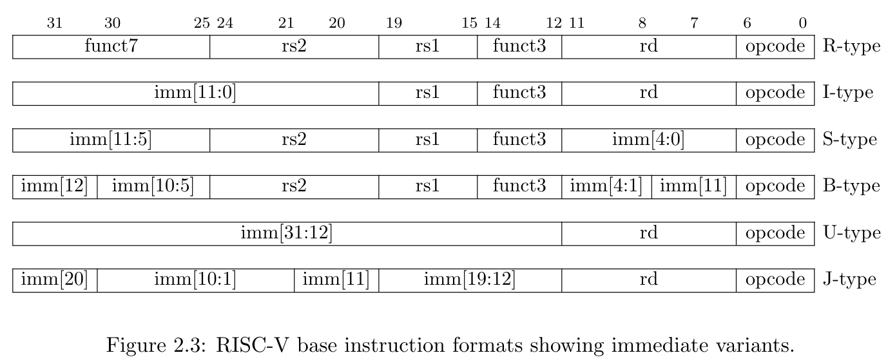
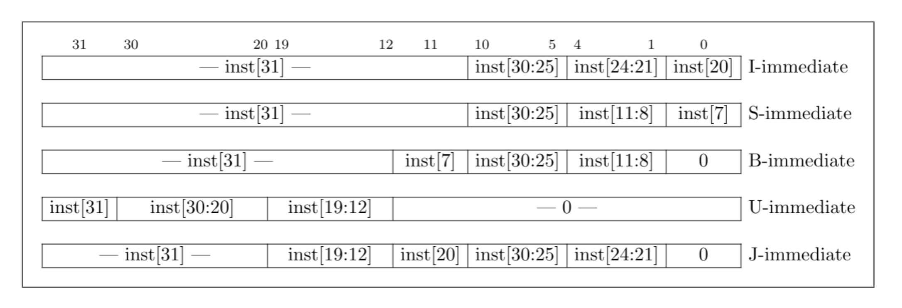

# INTRO

Here are some notes about lessons learned through this crash-course 

> 📘 __What kinds of architecture actually exists?__
>
> In this course, is presented the type load-store type. Even though, there are other common archictectures that should be mentioned: stack and accumulator.
>
> -__Stack__ : Uses a stack-based hardware in order execute aritmethic-like operations: add, mult and subtrations. This kind operates with instructions based on one-operand. Also, it's operartions cand be generalized on: push, pop and few others arithmetics.
> 
> -__Accumulator__ : Here we have an implicit accumulator to operate. Similar to stack, it's instructions are one-operand based. Also, your operation include load and store, but your structure is based in a single register to accumulate previous operations.

## SPECS
RISC-v Instructions are based on 6 standards (in this course was addressed the main ones).
|TYPE|DESCRIPTION|
|--|--|
|R| Register to Register and loads|
|I| Short Immediate and loads|
|S| Stores|
|B| Conditional Branches, variation from S|
|U| Long Immediates|
|J| unconditional Jumps, variation from U|

Here in this image, we have a how format instruction is organized, taking into account that we're working with RV32I

Specification of how immediate vector is denoted, in accord to format instruction type.

## REFERENCES
- [LinuxFoundationX LFD111x
Building a RISC-V CPU Core](https://www.edx.org/learn/design/the-linux-foundation-building-a-risc-v-cpu-core?index=product&queryID=5aa3bfa5f947c52844d702176fde6422&position=1&results_level=first-level-results&term=LD111X&objectID=course-2b0876d4-a9e5-4aab-a4c5-bee3db4e8c86&campaign=Building+a+RISC-V+CPU+Core&source=edX&product_category=course&placement_url=https%3A%2F%2Fwww.edx.org%2Fsearch)
- [RISCV Specs](https://riscv.org/technical/specifications/)